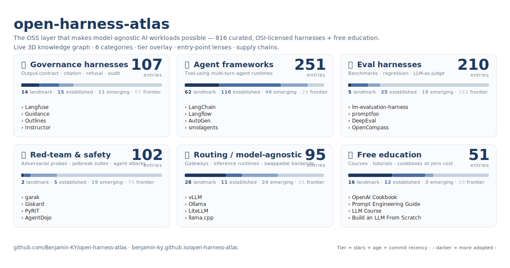
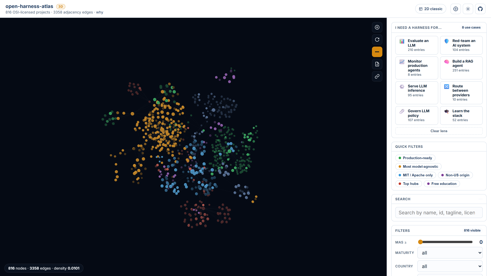
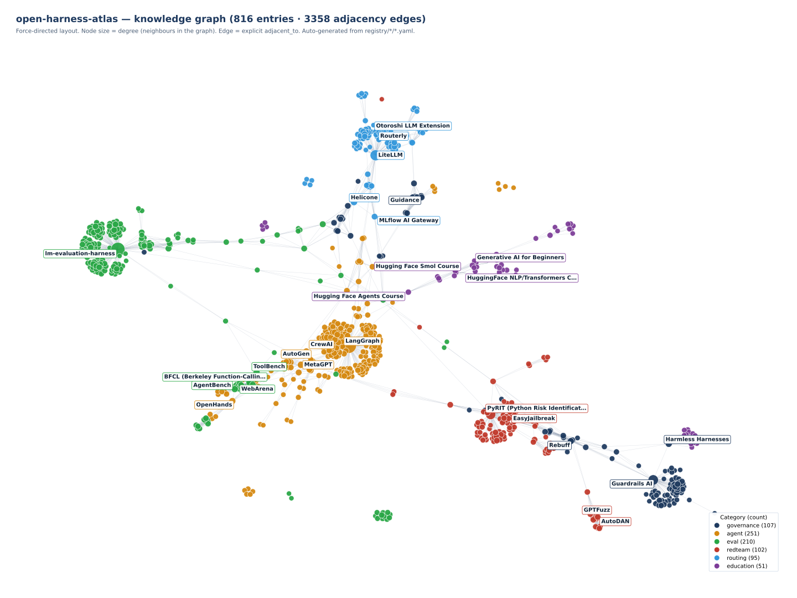

# open-harness-atlas

> *Created by **[Ben Kereopa-Yorke](https://github.com/Benjamin-KY)**, Co-Founder at **[Australi.ai](https://australi.ai)**.*

### **The OSS layer that makes model-agnostic AI workloads possible.**

*A curated, jurisdiction-neutral catalog and knowledge graph of free,
open-source harnesses — governance, agent, evaluation, red-team,
routing — and free education resources.*

[](LICENSE)
[](LICENSE-DOCS)
[](pyproject.toml)
[](docs/)
[](GOVERNANCE.md)

---



## The graph

> 🌐 **[Open the 3D interactive knowledge graph →](https://benjamin-ky.github.io/open-harness-atlas/)**
>
> 793 nodes · 3,148 adjacency edges · WebGL 3D view (drag to orbit, scroll to
> zoom), live search, faceted filters, BFS path finder, curated tours,
> particle-flow edges, dark canvas, deep-linkable. Prefer the classic 2D
> layout? **[Open the 2D viewer →](https://benjamin-ky.github.io/open-harness-atlas/2d.html)**
> (mini-map, compare mode, cluster layout, PNG export).
>
> **🎯 Entry points** ("I need a harness for…") — eight curated lenses
> (evaluate an LLM, red-team an AI system, monitor production agents, build a
> RAG agent, serve inference, route across providers, govern LLM policy,
> learn the stack) filter the graph to the entries that actually solve
> that job, with featured / recommended / auto-matched tiers. Deep-link
> with `#lens=evaluate-llm`.
> **🔗 Harness supply chains** — six curated directional stacks
> (serve-and-ship-agent, eval-driven-development, redteam-then-harden,
> rag-pipeline, alignment-train-and-eval, multi-tenant-gateway) overlay
> the canonical 3–7-step paths through the graph, with named alternatives
> at each step. Deep-link with `#chain=rag-pipeline`.
>
> Both views are auto-generated from `registry/*/*.yaml` +
> `companion/use_cases.yaml` + `companion/supply_chains.yaml`, and are
> re-deployed on every push to `main`.

[](https://benjamin-ky.github.io/open-harness-atlas/)

*The live 3D viewer (click to open). Orange = agent · green = eval · blue = governance · slate-blue = routing · red = red-team · purple = education. Right rail: eight entry-point lenses, quick filters, search, faceted filters. Drag to orbit, scroll to zoom.*



*Force-directed static layout (for context / link previews). Node colour = category. Node size = degree (how many neighbours the entry has in the graph). Edge = explicit `adjacent_to` declaration. Clusters are not hand-drawn — they fall out of the data.*

---

> ⚠ **Pre-release (v0.1.0-dev).** Registry holds **793 entries** across
> six categories (governance 101 · agent 231 · eval 203 · redteam 94 ·
> routing 92 · education 72) — the v0.2.0 expansion added 491 entries
> via the systematic GitHub-topic-discovery harness in
> [`scripts/discovery/`](scripts/discovery/) (deterministic, reproducible,
> no from-memory shortlists). The v0.1.0 seed (313 entries) was curated
> from awesome-lists (`corca-ai/awesome-llm-security`,
> `tensorchord/awesome-llmops`, `e2b-dev/awesome-ai-agents`,
> `yueliu1999/Awesome-Jailbreak-on-LLMs`, `onejune2018/awesome-llm-eval`,
> and others), GitHub topic searches (`llm-evaluation`, `ai-gateway`,
> `llm-judge`, `agent-eval`, `llm-benchmark`, …), and recent surveys
> (NeurIPS / ICML / ACL / USENIX 2024–2026). All entries are
> OSI-licensed per `GOVERNANCE.md` §1.1.
>
> **Honest curation disclosure.** **770 of 793 entries (97%) have been
> reviewed** — 367 by hand against `GOVERNANCE.md` §8, plus 403 via a
> three-model ensemble pass (Claude Sonnet 4.6 + Claude Opus 4.7 +
> GPT‑5.4 each independently reviewing the same entry, with consensus
> ≥ 2/3 required to apply any field change, category move, or removal;
> 21 entries with three-way dissent are deferred to human review).
> The merge audit trail (per-entry, per-reviewer rationale + confidence)
> is preserved in the session report. The remaining **23 entries are
> tracked publicly in [`docs/CURATION_BACKLOG.md`](docs/CURATION_BACKLOG.md)**.
> PRs that move an entry off the backlog or resolve a deferred dissent
> remain the single most-valuable contribution the catalogue can receive.
>
> **Out of scope for the registry by design**: closed-source projects;
> non-OSI licenses (so Llama Guard 3 and ShieldGemma are excluded
> under `GOVERNANCE.md` §1.1, even where they are technically excellent);
> internal / unreleased projects (so the author's research repo
> `sa-sovereign-llm-harness` is *not* a deferred candidate — it is
> referenced as the canonical source of the framing in `CHARTER.md`
> but does not enter the catalog regardless of its future
> publication status); resources without an underlying OSS repository
> (so DeepLearning.AI shorts, however useful, do not satisfy the
> registry schema).

---

## Why this exists

The **2026-06-13 Fable / Mythos export-control recall** removed two
frontier Anthropic models from worldwide access in hours under a US
national-security directive. Every deployment whose only model tier was
`claude-fable-5` or `claude-mythos-5` paged its operators inside the
hour. Every deployment that treated the model as a swappable backend
behind a harness ran a config edit and kept serving.

This atlas catalogues the OSS layer of that second pattern. Read
[`CHARTER.md`](CHARTER.md) for the full motivating context (the
broader closed-garden trend, the Indigenous-data-governance framing, and
why "jurisdiction-neutral" is a design commitment, not a slogan).

---

## How harnesses are the foundation for model-agnostic workloads

A **harness** is the structural scaffolding *around* the model that
makes the model itself swappable. In the [Harmless Harnesses][hh] spec,
a harness has five components, each enforcing one invariant:

| # | Component | Invariant |
|---|---|---|
| 1 | **Policy Router** | Every request is classified into a known route before the model is called. |
| 2 | **Source Authority** | Every claim cites an allow-listed source; the knowledge base is truth. |
| 3 | **Prompt Composer** | The governance-prompt template is the only system-role surface. |
| 4 | **Output Contract** | Malformed or out-of-policy output is non-shippable. |
| 5 | **Audit Log + FSM Escalation** | Refusal and escalation are deterministic, not stochastic. |

When these five hold, **the model is one input among many** — and you
can swap it. The atlas catalogues which OSS projects implement which
components, side by side:


The atlas exists to make the *open* components of this pattern
(governance harnesses, agent frameworks, eval harnesses, red-team
harnesses, routing infrastructure, free education) findable and
comparable.

[hh]: https://github.com/Benjamin-KY/Harmless-Harnesses

---

## The six categories

| Category | What's catalogued | Entries |
|---|---|---|
| 🛡  **Governance harnesses** | Output-contract / citation / refusal / audit / observability-with-eval-features | 101 |
| 🤖 **Agent frameworks** | Tool-using multi-turn agent runtimes | 231 |
| 📏 **Eval harnesses** | Behaviour measurement runners | 203 |
| 🎯 **Red-team / safety harnesses** | Adversarial probes & attack-class coverage | 94 |
| 🔀 **Routing / model-agnostic infra** | Provider gateways & swappable backends | 92 |
| 🎓 **Free education** | Courses · tutorials · cookbooks at zero cost | 72 |
| | **Total** | **793** |

Counts auto-validated on every push by `tests/test_registry.py`. Visual
adoption tiers (Landmark · Established · Emerging · Frontier — derived
from stars + age + commit recency) overlay the graph so newer entries are
visible without sitting visually equal to landmark projects.
**Uptake velocity** (stars-per-week over a trailing 4-week window) is
tracked per entry in the scheduled metadata refresh and ranked in
[`docs/rising.md`](docs/rising.md); detail panels in both viewers show
a tiny inline sparkline. See
[`docs/sovereignty-rubric.md` §7–8](docs/sovereignty-rubric.md) for
methodology.

**Deployment posture** — every entry now declares one of five postures so
the catalogue can answer "if I install this today, can I run it locally?"
in one click. Current distribution: 573 local-first (72%) · 133 local-only
(17%) · 37 cloud-first (5%) · 30 hybrid (4%) · 20 api-only (3%) — 92.8%
of the catalogue is realistically self-hostable.
Classified by heuristic + 3-model ensemble (claude-sonnet-4.5 +
claude-opus-4.7-xhigh + gpt-5.4); see
[`docs/deployment-posture.md`](docs/deployment-posture.md) and the
[posture chart](visuals/deployment-posture.svg) for the per-category
breakdown. Filter the viewer with the **Local-possible only** chip to
hide cloud-first + api-only entries in one click.

**Out-of-scope by design** (cross-linked in [`docs/adjacencies.md`](docs/adjacencies.md),
not catalogued): pure-infrastructure vector databases · closed-source services ·
paid courses · personal blog posts. See [`GOVERNANCE.md`](GOVERNANCE.md) §8
for the full exclusion policy.

---

## Use this atlas

**Browse** (no tooling required — works on GitHub from anywhere):

- Start with [`CHARTER.md`](CHARTER.md) for context.
- Open [`docs/taxonomy.md`](docs/taxonomy.md) for the 6-category map.
- Open [`docs/sovereignty-rubric.md`](docs/sovereignty-rubric.md) for
  the scoring methodology.
- Open [`docs/deployment-posture.md`](docs/deployment-posture.md) for
  the "where does it run?" dimension (local-only · local-first ·
  hybrid · cloud-first · api-only).
- Read [`docs/patterns/`](docs/patterns/README.md) for the **7 named
  harness design patterns** (eval-driven gate · sovereignty-preserving
  routing · red-team then harden · audit-log FSM escalation ·
  multi-tenant policy isolation · provider fallback chain ·
  local-possible spine).
- Read [`docs/worked-example-model-agnostic-stack.md`](docs/worked-example-model-agnostic-stack.md)
  for a full walkthrough that assembles a locally-deployable,
  model-agnostic stack from the atlas — step by step, with the
  design pattern, the posture filter, and the picks at each layer.
- Open the comparison matrices: [`docs/governance-matrix.md`](docs/governance-matrix.md),
  [`docs/agent-matrix.md`](docs/agent-matrix.md), and the four others
  under [`docs/`](docs/).
- Came here from the Fable / Mythos news? Jump to
  [`docs/fable-mythos-pattern-fire.md`](docs/fable-mythos-pattern-fire.md).

**Contribute** an entry:

```powershell
git clone https://github.com/Benjamin-KY/open-harness-atlas
cd open-harness-atlas
python -m venv .venv ; .\.venv\Scripts\Activate.ps1
pip install -e ".[dev]"
Copy-Item registry\_TEMPLATE.yaml registry\<category>\<my-entry>.yaml
# edit, then:
python scripts\validate_registry.py
python -m pytest -q
```

See [`CONTRIBUTING.md`](CONTRIBUTING.md) for the full PR flow and the
inclusion rubric in [`GOVERNANCE.md`](GOVERNANCE.md).

**Run the interactive companion** (optional — requires Docker + Neo4j):

```powershell
make neo4j-local        # launches Neo4j 5 on bolt://localhost:7687
make companion          # emits companion/domain/open-harnesses.yaml
cd companion ; create-context-graph ./app --domain ./domain/open-harnesses.yaml --framework pydanticai --demo-data
```

The companion is a [`create-context-graph`][ccg]-generated FastAPI + Next.js
app with NVL graph visualization, backed by Neo4j, queryable via the
PydanticAI agent. The fixtures are derived from this repo's registry —
*not* LLM-fabricated. See [`companion/README.md`](companion/README.md).

[ccg]: https://github.com/Benjamin-KY/create-context-graph

---

## Repository map

```
open-harness-atlas/
├── CHARTER.md                 # Why this exists — Fable/Mythos, closed-garden, IDSov framing
├── CONTRIBUTING.md            # How to add an entry
├── GOVERNANCE.md              # Inclusion / scoring / removal policy
├── BRAND.md                   # Palette, typography, diagram conventions (mirrors harmless-harnesses)
├── CITATION.cff               # Academic citation metadata
├── CHANGELOG.md               # Per-release changes
├── registry/                  # SINGLE SOURCE OF TRUTH — one YAML per entry
│   ├── _schema.yaml           # JSON schema for entry validation
│   ├── _TEMPLATE.yaml         # Copy this to add a new entry
│   ├── _metadata/             # Auto-refreshed JSON sidecars (bot-owned, do not hand-edit)
│   ├── governance/            # Governance harnesses
│   ├── agent/                 # Agent frameworks
│   ├── eval/                  # Eval harnesses
│   ├── redteam/               # Red-team / safety harnesses
│   ├── routing/               # Routing / model-agnostic infra
│   └── education/             # Free education resources
├── docs/                      # Taxonomy, matrices, rubrics, worked examples
├── visuals/                   # hero.svg (banner) · graph.svg (knowledge graph) · viewer-3d/preview.png · five-component-overlay.svg · interactive viewers (index.html + 2d.html)
├── scripts/                   # Validate / refresh / build (Python 3.11+)
├── companion/                 # Optional create-context-graph companion app
├── tests/                     # pytest — hermetic by default
└── .github/                   # Workflows + issue templates
```

---

## Verification

Every PR must pass:

```powershell
python -m pytest -q                # schema · uniqueness · matrices consistency · visuals build
python scripts\validate_registry.py
ruff check scripts tests
```

The weekly `refresh-metadata.yml` action pulls fresh GitHub metadata
into `registry/_metadata/<id>.json` and opens a PR with the diff. The
hermetic test suite never reaches the network; the optional link-check
runs on a separate weekly schedule.

---

## Where this atlas fits

| | This atlas | [Harmless Harnesses][hh] | [sa-sovereign-llm-harness][sa] |
|---|---|---|---|
| **Role** | Catalog the OSS layer | Teach how to build a harness | Research-grade prototype + evidence |
| **Voice** | Field guide. Neutral. Citation-heavy. | Pedagogical. Practitioner. | Research. IMRAD. Primary-source-grounded. |
| **Updates** | Continuous (weekly metadata refresh) | Tagged releases | Tagged releases |
| **You exit here to…** | The course (to learn how to build) · the research repo (for primary evidence) | The atlas (to find an OSS implementation) | The atlas (for adjacent tooling) |

Strict separation of concerns — no duplication. Cross-links land at
v1.0.0.

[sa]: https://github.com/Benjamin-KY/sa-sovereign-llm-harness

---

## License

Dual-licensed:

- **Code** (`scripts/`, `tests/`, `*.py`) — **Apache-2.0**. See
  [`LICENSE`](LICENSE).
- **Catalog content & visuals** (`registry/`, `docs/`, `visuals/`,
  top-level Markdown) — **CC BY-SA 4.0**. See [`LICENSE-DOCS`](LICENSE-DOCS).

---

## Citation

```
Kereopa-Yorke, B. (2026). open-harness-atlas: a jurisdiction-neutral
catalog and knowledge graph of free, open-source harnesses for
model-agnostic AI workloads. https://github.com/Benjamin-KY/open-harness-atlas
```

Machine-readable metadata in [`CITATION.cff`](CITATION.cff).

---

<div align="center">
  <sub>
    Also known as / search terms:
    OSS LLM harness catalog · open-source AI safety frameworks ·
    model-agnostic AI infrastructure · sovereign AI tooling ·
    awesome harnesses · LLM governance frameworks · agent framework
    comparison · LLM eval harness directory · LLM red-team tooling ·
    AI model routing.
  </sub>
</div>
