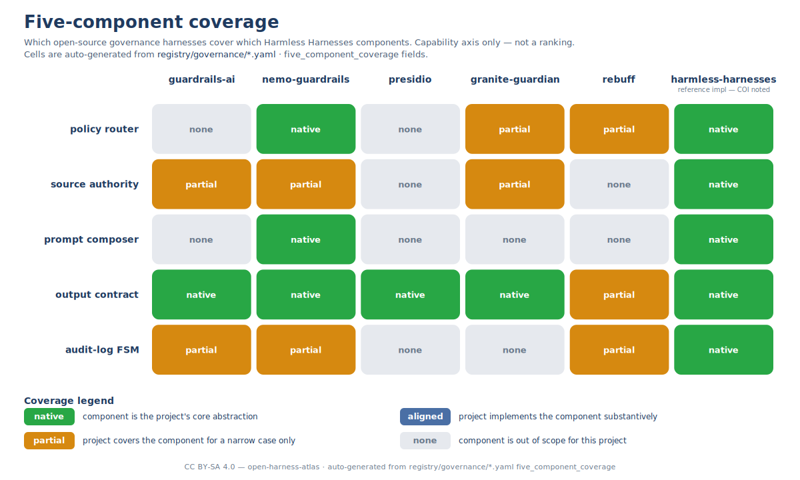

# Five-component overlay

The **Harmless Harnesses** decomposition factors an LLM-governance layer
into five components, each enforcing one invariant. This page records
which open-source governance projects implement which components, with
links into the registry for the curated detail.

## The five components and the invariants they enforce

| # | Component | Invariant |
|---|---|---|
| 1 | **Policy Router** | Every request is classified into a known route before the model is called. |
| 2 | **Source Authority** | Every claim cites an allow-listed source; the knowledge base is the truth surface. |
| 3 | **Prompt Composer** | The governance-prompt template is the only system-role surface. |
| 4 | **Output Contract** | Malformed or out-of-policy output is non-shippable — refusal is deterministic. |
| 5 | **Audit Log + FSM Escalation** | Refusal and escalation are deterministic, not stochastic; every decision is logged. |

Definitions follow *The Harness Paradigm* (Kereopa-Yorke, 2026) and the
[`harmless-harnesses`][hh] reference implementation.

[hh]: https://github.com/Benjamin-KY/Harmless-Harnesses

## Coverage values

Each cell in the overlay reports one of four values, mirrored from each
governance entry's `five_component_coverage` field in
`registry/governance/<id>.yaml`:

| Value | Meaning |
|-------|---------|
| `native` | The component is the project's core abstraction (you would describe the project *as* this component). |
| `aligned` | The project implements the component substantively, even if it is not the project's headline framing. |
| `partial` | The project covers the component for a narrow case only (a specific provider, a specific format, a specific risk class). |
| `none` | The component is out of scope for the project. |

These are **capability values**, not quality scores. A `none` for one
component does not say anything bad about the project — it says the
project does a different thing, and you should compose it with something
else to cover the missing component. The whole point of the harness
paradigm is that the five components are *separable*; expecting any
single project to be `native` on all five is the wrong reading.

## How to read the overlay

- **Rows = the five components.** Read across to compare projects on one
  invariant.
- **Columns = governance projects.** Read down to see a project's full
  coverage profile.
- **`harmless-harnesses` is the reference implementation** of the five
  components and so scores `native` on all five — this is by definition,
  not by quality boast. The `harmless-harnesses` entry has a conflict-
  of-interest disclosure (`GOVERNANCE.md` §5) acknowledging that the
  rubric was defined against this project.

## Composition patterns

The most common production patterns combine two or three projects across
the row to get a full five-component cover:

1. **guardrails-ai (output-contract `native`) + nemo-guardrails (policy-
   router `native`)** — a common pairing for output-validation atop a
   conversational policy layer.
2. **presidio (source-authority focus) + anything from columns 1–5** —
   when the source-authority component is dominated by PII / sensitive-
   information detection at boundary, presidio is the canonical pick.
3. **harmless-harnesses (all five `native`) standalone** — the reference
   build, used as the teaching target and the regression baseline; not
   inherently better, but minimises composition complexity for the
   common case.

The atlas does not pick a winner. The overlay is a **decision aid** for
contributors to find the projects that cover the components their own
deployment needs, not a leaderboard.

## How this overlay stays accurate

When a registry entry's `five_component_coverage` field is updated, the
overlay SVG and this Markdown page are updated in the same PR. The
overlay is **hand-authored** (committed as `visuals/five-component-
overlay.svg`); both files are reviewed together. See
[`visuals/README.md`](../visuals/README.md) for the rationale on which
visuals are hand-authored vs generated.
