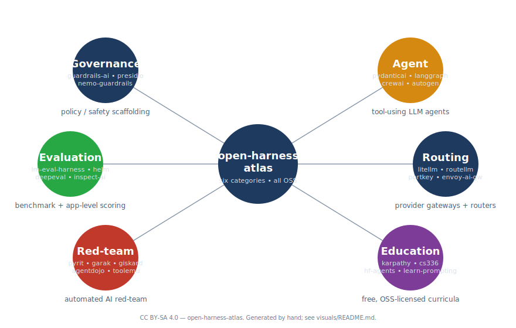

# Taxonomy — the six categories

`open-harness-atlas` partitions its registry into six categories. The cut
follows the **Harmless Harnesses** decomposition of the LLM-application
stack: governance, agent, eval, red-team, routing — plus an education
category for the free curricula that teach the same patterns from
foundations through frameworks.

## Decision rule for category membership

Each entry sits in **exactly one** category — the one that best matches
the project's *primary* abstraction, not the union of every feature it
ships. This keeps the catalog browsable without cross-listing the same
project in three categories.

When a project genuinely straddles categories, the secondary fit is
captured via the entry's `adjacent_to:` field (and, for clearly-adjacent-
but-out-of-scope projects, in `docs/adjacencies.md`).

## The six categories

### 1. Governance harnesses — `registry/governance/`

Output-contract enforcement, citation gating, refusal-and-escalation, and
audit-log infrastructure around an LLM. The defining test: **does the
project care about what the model *outputs* in a structured, enforceable
way, regardless of which model is producing the output?** If yes,
governance.

Examples: `guardrails-ai`, `nemo-guardrails`, `granite-guardian`,
`rebuff`, `presidio`, `harmless-harnesses`.

### 2. Agent frameworks — `registry/agent/`

Tool-using, multi-turn LLM agent runtimes. The defining test: **does the
project orchestrate an LLM that can call tools across multiple turns
toward a goal?** If yes, agent.

Examples: `pydanticai`, `langgraph`, `crewai`, `autogen`, `smolagents`,
`openai-agents-sdk`, `claude-agent-sdk` (provider-coupled — see
`docs/fable-mythos-pattern-fire.md`), `google-adk`, `strands`,
`llama-index-agents`.

### 3. Evaluation harnesses — `registry/eval/`

Behaviour-measurement runners — academic benchmarks, application-level
test frameworks, RAG-specific evaluators. The defining test: **does the
project answer "how well does this model / this application perform?"
in a reproducible, scriptable way?** If yes, eval.

Examples: `lm-evaluation-harness`, `helm`, `deepeval`, `ragas`,
`promptfoo`, `inspect-ai` (UK AISI), `lighteval`, `openai-evals`.

### 4. Red-team / safety harnesses — `registry/redteam/`

Adversarial probing of model and agent behaviour — prompt-injection
scanners, jailbreak orchestrators, tool-use safety benchmarks. The
defining test: **does the project deliberately try to *break* a model
or an agent in a structured, reportable way?** If yes, red-team.

Examples: `pyrit` (Microsoft), `garak` (NVIDIA), `promptmap`, `agentdojo`
(ETH Zürich), `toolemu`, `giskard`.

### 5. Routing / model-agnostic infrastructure — `registry/routing/`

Provider gateways, model routers, and any layer whose explicit purpose
is to make the *model tier itself* swappable. The defining test: **does
the project let the application code stay the same when the model /
provider / jurisdiction changes?** If yes, routing.

Examples: `litellm`, `routellm`, `aisuite`, `portkey-gateway`,
`envoy-ai-gateway`, `helicone`.

### 6. Free education resources — `registry/education/`

Open-licensed courses, tutorials, and cookbooks that teach how to build
the layers above. The defining test: **is this primarily a learning
resource (curriculum, lecture series, exercise notebooks) rather than
a runnable harness?** If yes, education.

Examples: `karpathy-nn-zero-to-hero`, `stanford-cs336`, `fast-ai-course22`,
`hugging-face-agents-course`, `microsoft-ai-agents-for-beginners`,
`anthropic-prompt-eng-tutorial`, `learn-prompting`, `openai-cookbook`.

## Why exactly these six

The decomposition is **not** "every layer of the LLM stack". RAG cores
(pure retrieval), observability stacks (Langfuse, Phoenix), and vector
databases are deliberately **out of scope** — they are adjacent
infrastructure, but the atlas is about *the harness*, not the entire
stack. Reasoning:

- The five Harmless Harnesses components (policy router · source
  authority · prompt composer · output contract · audit-log FSM) all
  live inside the governance category.
- An **agent framework** is the runtime that the harness's policy
  router wraps.
- An **eval harness** is the regression gate that asserts the harness
  is doing its job.
- A **red-team harness** is the adversarial counterpart of eval.
- A **routing layer** is what makes the model-tier of the entire stack
  swappable, which is the precondition for sovereignty.
- **Free education** is included because the goal is not "find a tool";
  it is "build the capability". A catalog of tools without a catalog of
  free curricula is half a sovereignty story.

Everything else (RAG cores, observability stacks, vector DBs) lives in
`docs/adjacencies.md` with a one-line explanation of why it is adjacent
rather than central. Lists everywhere can grow without bound; the atlas
keeps the cut deliberate.
